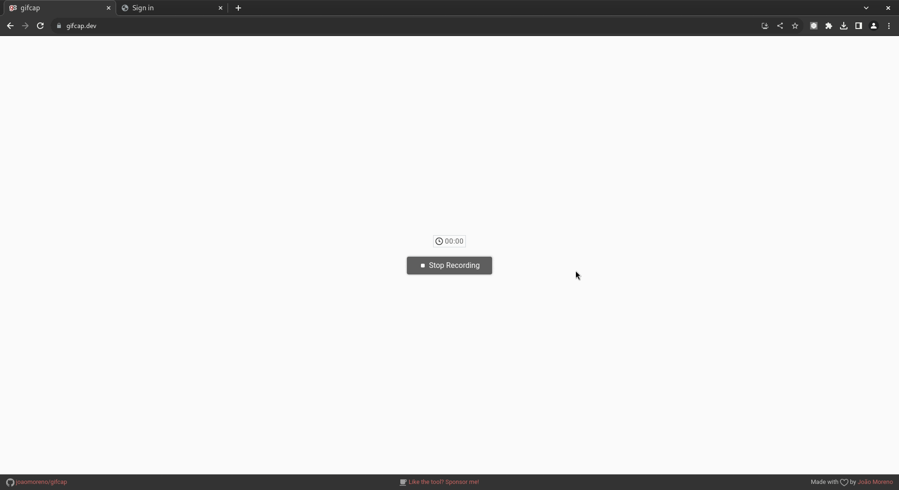

# Vinland To Do App

> Demo: create and manage To Do lists

This application is an example of the [Vinland](https://github.com/lisplizards/vinland) web framework.



Features:
* Register an account: claim a unique username and set a password
* Sign in
* Create and delete To Do lists
* Create, delete, and mark complete/incomplete tasks within each To Do list
* Demonstration of setting and removing non-session cookies
* Sign out

Technologies:
* Server: [woo](https://github.com/fukamachi/woo)
* Database: [rucksack](https://gitlab.common-lisp.net/rucksack/rucksack) (Lisp object persistence)
* Framework: [vinland](https://github.com/lisplizards/vinland)
* JavaScript libraries: Hotwire [Turbo](https://github.com/hotwired/turbo) and [Stimulus](https://github.com/hotwired/stimulus), [Shoelace](https://shoelace.style/) web components

## Known issues

Rucksack does not compile on ECL.

## Installation

Not in Quicklisp, so clone the repository to "local-projects/".

### System requirements

* [libev](http://software.schmorp.de/pkg/libev.html) (dependency of Woo)

### Build

Build the program by running:

```lisp
(asdf:make :vinland-todo-app)
```

The binary is written to "./bin/todo-app".

### Run

```sh
./bin/todo-app start -p 8080 -a 0.0.0.0 -w 4
```

### Dependencies

* [cl-bcrypt](https://github.com/dnaeon/cl-bcrypt)
* [clingon](https://github.com/dnaeon/clingon)
* [com.inuoe.jzon](https://github.com/Zulu-Inuoe/jzon)
* [foo.lisp.lack-middleware-charset](https://github.com/lisplizards/lack-middleware-charset)
* [foo.lisp.lack-middleware-head](https://github.com/lisplizards/lack-middleware-head)
* [foo.lisp.lack-middleware-http-methods](https://github.com/lisplizards/lack-middleware-http-methods)
* [foo.lisp.lack-middleware-redis](https://github.com/lisplizards/lack-middleware-redis)
* [foo.lisp.lack-middleware-request-id](https://github.com/lisplizards/lack-middleware-request-id)
* [foo.lisp.lack-middleware-security-headers](https://github.com/lisplizards/lack-middleware-security-headers)
* [foo.lisp.lack-middleware-user](https://github.com/lisplizards/lack-middleware-user)
* [foo.lisp.lack-session-store-redis-pool](https://github.com/lisplizards/lack-session-store-redis-pool)
* [foo.lisp.vinland](https://github.com/lisplizards/vinland)
* [frugal-uuid](https://github.com/ak-coram/cl-frugal-uuid)
* [lack-middleware-backtrace](https://github.com/fukamachi/lack/blob/master/lack-middleware-backtrace.asd)
* [lack-middleware-session](https://github.com/fukamachi/lack/blob/master/lack-middleware-session.asd)
* [lack-middleware-static](https://github.com/fukamachi/lack/blob/master/lack-middleware-static.asd)
* [lack](https://github.com/fukamachi/lack/blob/master/lack.asd)
* [local-time](https://github.com/dlowe-net/local-time)
* [make-hash](https://github.com/genovese/make-hash)
* [rucksack](https://gitlab.common-lisp.net/rucksack/rucksack)
* [rove](https://github.com/fukamachi/rove)
* [spinneret](https://github.com/ruricolist/spinneret)
* [safety-params](https://github.com/fukamachi/safety-params)
* [trivia](https://github.com/guicho271828/trivia)
* [woo](https://github.com/fukamachi/woo)

### JavaScript

* [Turbo](https://github.com/hotwired/turbo)
* [Stimulus](https://github.com/hotwired/stimulus)
* [Shoelace](https://shoelace.style/)

### Tests

* [rove](https://github.com/fukamachi/rove)

## Contributing

Not accepting PRs to this repo, but feel free to open an Issue on GitHub if there's a problem.

## Author

* John Newton

## Copyright

Copyright (c) 2024 John Newton

## License

Apache-2.0
